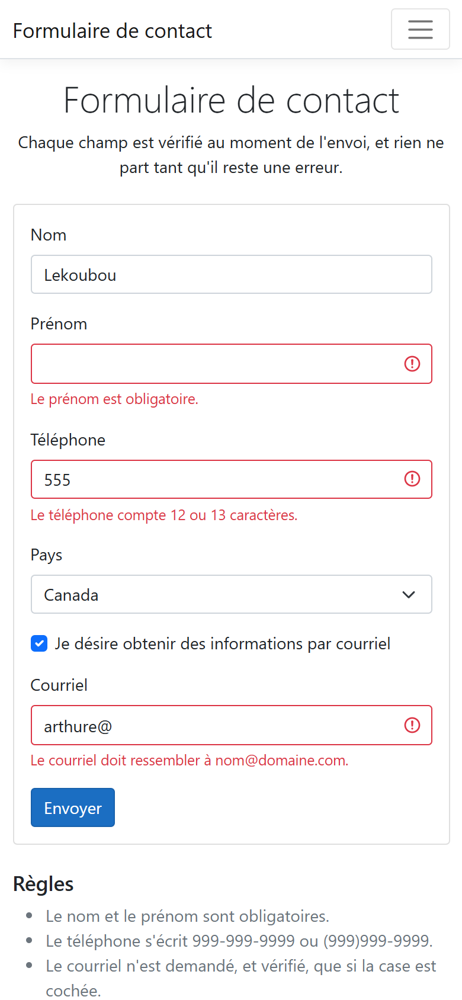

# form-validation

A contact form where every rule lives in JavaScript: the browser's own
validation is switched off, each field gets a precise message next to it, and
nothing is sent until every message is gone.

One script, no JavaScript library, no build step: open the file and try to
send it empty.

## Screenshots

## How it works

**The rules are a table, not a chain of ifs.** `REGLES` maps each field id
to a function that returns a message, or an empty string when the value is
fine. Validating one field is `REGLES[id](value)`; validating the form is a
`filter` over the ids. Adding a field is one entry.

**The browser stays out of it.** The form carries `novalidate` and no field
has `required`, `pattern` or a length limit, so every decision is visible in
the script. Name and first name are checked with `trim()`, not a regular
expression, as they should be.

**Twelve or thirteen characters, then the shape.** The phone rule first
checks the length, then one regular expression that accepts exactly
`999-999-9999` or `(999)999-9999`. The two messages are different, so the
person knows which of the two things is wrong.

**The email depends on the checkbox.** Unchecked, the field is ignored
whatever it holds. Checked, it must be present and look like
`name@domain.tld`. Toggling the box re-validates the field on the spot.

**Nothing leaves with an error.** On `submit`, the handler validates every
field, and if any message remains it calls `preventDefault` and moves focus
to the first faulty field. Typing in a field re-validates it, so a message
disappears as soon as the correction is made.

## Running it

Open `index.html` in a browser. There is nothing to install. A valid send
lands on `ok.html`.

## Stack

HTML, CSS with Bootstrap 5.1 for the grid and the form controls, and vanilla
JavaScript. One script, no JavaScript library.

## Résumé

Formulaire de contact validé entièrement en JavaScript : la validation du
navigateur est désactivée par `novalidate` et aucun champ ne porte
d'attribut HTML5 de contrainte. Les règles forment une table qui associe
chaque champ à une fonction rendant un message, ou une chaîne vide. Le nom et
le prénom sont vérifiés par `trim()`, sans expression régulière. Le téléphone
doit compter 12 ou 13 caractères et prendre la forme `999-999-9999` ou
`(999)999-9999`, avec un message différent pour la longueur et pour le
format. Le courriel n'est exigé, et vérifié, que si la case est cochée, et
cocher ou décocher la case le revalide aussitôt. À l'envoi, chaque champ est
validé, le premier fautif reçoit le focus et la soumission est bloquée tant
qu'il reste un message ; corriger un champ en tapant efface son message.

## Licence

MIT. See [LICENSE](LICENSE).
